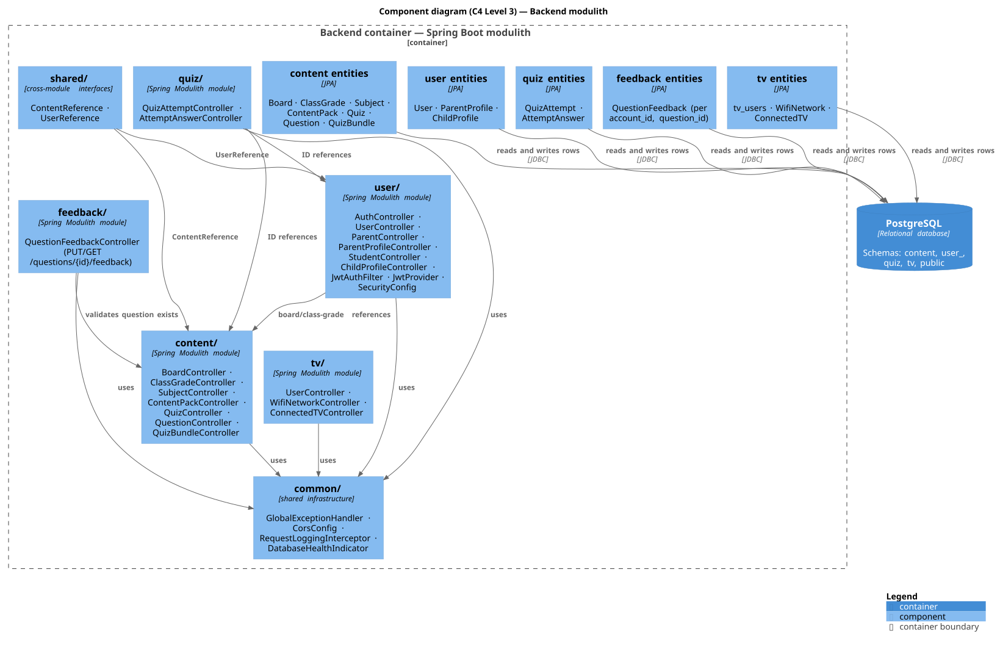

# Backend modulith

Source: `study-shield-backend/ss-modulith/docs/ss-modulith.md`.

## Overview

Single deployable Spring Boot application (modular monolith) replacing the previous
5-microservice architecture. Port 8080, single JVM, single PostgreSQL with per-module schemas.

## Component diagram (C4 Level 3)

The internal modules of the **Backend** container (Spring Modulith), their key
controllers/services, and how the modules depend on each other.



Source: `diagrams/backend-component.puml` (rendered with PlantUML + C4-PlantUML via
`./scripts/diagrams.sh`).

### Module dependency notes

- **content/** is standalone; **user/** depends on content (board/class-grade references);
  **quiz/** depends on content + user (ID references); **feedback/** depends on content
  (validates the question exists). **tv/** uses external IDs only.
- **common/** is used by every module (error handling, CORS, request logging).
- **shared/** exposes `ContentReference` / `UserReference` for cross-module lookups.

## Modules

- **common/** — shared infra: `ResourceNotFoundException`, `GlobalExceptionHandler`,
  `CorsConfig`, `RequestLoggingInterceptor`.
- **content/** — Board, ClassGrade, Subject, ContentPack, Quiz, Question, QuizBundle
  entities. API: `/api/v1/{boards,class-grades,subjects,content-packs,quizzes,questions,quiz-bundles}/**`.
- **user/** — User, ParentProfile, ChildProfile; `/api/auth/**`, `/api/v1/{users,parents,students,children}/**`.
- **quiz/** — QuizAttempt, AttemptAnswer; `/api/v1/quiz-attempts/**`, `/api/v1/attempt-answers/**`.
- **feedback/** — QuestionFeedback (upsert per `(account_id, question_id)`);
  `PUT|GET /api/v1/questions/{id}/feedback`.
- **tv/** — Tv Users, WifiNetwork, ConnectedTV.
- **shared/** — cross-module interfaces (`ContentReference`, `UserReference`).

## Content loading model

The backend **starts empty** (`app.catalog-seeding.enabled: false`). Content is loaded on
demand via **`POST /api/v1/questions/load`**, which auto-creates the whole chain:

```
Board → ClassGrade → Subject → ContentPack → Quiz → Question
```

from items carrying `boardCode` / `className` / `age` / `subject`. See
[question-bank guide](../decisions/question-bank-guide.md) for the full rules.

Quiz bundles are returned per class by `POST /api/v1/quiz-bundles` (lazy
`QuizBundleSeeder` fills freemium quizzes from the curated bank, falling back to a real
fallback bank so a session never starts empty).

## Config

- `spring.jpa.hibernate.ddl-auto=validate`
- `spring.flyway.schemas=public,content,user_,quiz,tv`
- `app.jwt.expiration-ms=86400000`
- `app.catalog-seeding.enabled=false` (on-demand content model)

## Build / test

```bash
cd REPOS/study-shield-backend
./gradlew :ss-modulith:test
```

Android builds require **JDK 21 Corretto**:
`export JAVA_HOME="/Users/hulk/Library/Java/JavaVirtualMachines/corretto-21.0.2/Contents/Home"`.
