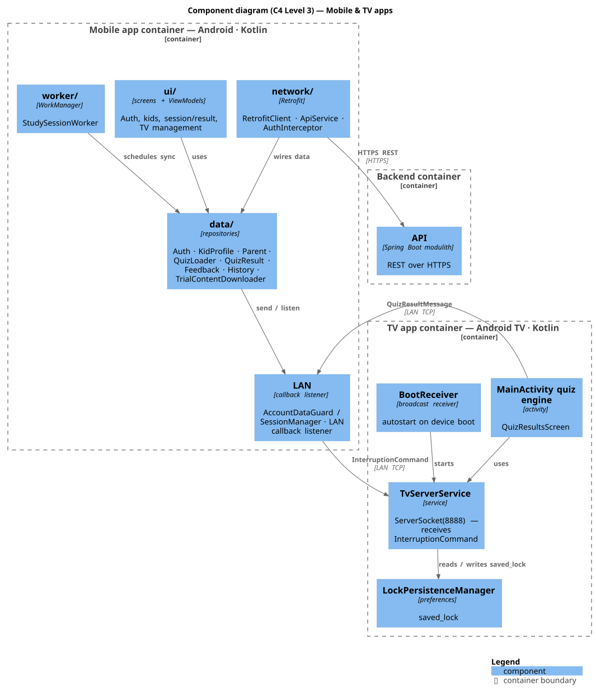

# Mobile & TV apps

Source: `study-shield/` (Android Studio project with `mobile/` and `tv/` modules).

## Component diagram (C4 Level 3)

The internal components of the **Mobile app** and **TV app** containers and how they map
to the external connections shown in the [container diagram](system.md).



Source: `diagrams/mobile-tv-component.puml` (rendered with PlantUML + C4-PlantUML via
`./scripts/diagrams.sh`).

## Mobile app

- Parent auth/signup, kid profiles ("Kid 1" default, grade "Trial"), quiz presentation config.
- **Content is server-first**: `QuizLoader` issues `POST /api/v1/quiz-bundles` and returns
  what the backend provides. **No bundled quiz assets** ship in the APK.
- On login, `TrialContentDownloader` seeds the Trial/Nursery question bank to the backend
  (`POST /api/v1/questions/load`) fire-and-forget so Trial always has content.
- Sends `InterruptionCommand` to the TV with `mobileIp` + `resultCallbackPort` and listens
  for the `QuizResultMessage` on that port.

## TV app

- Plays content; shows quizzes during ad breaks.
- Runs the quiz and returns `QuizResultMessage` to the mobile's callback port.
- `checkSavedLock()` must not replay a stale `saved_command` with an old account's
  `kar`/`mobileIp`/callback fields.

## Cross-app invariant

Both mobile and TV keep their **own** `InterruptionCommand` / `QuizResultMessage` copies.
Any new field (e.g. `kidName`) must be added to BOTH or result attribution breaks.

## Build

```bash
export JAVA_HOME="/Users/hulk/Library/Java/JavaVirtualMachines/corretto-21.0.2/Contents/Home"
cd REPOS/study-shield
./gradlew :mobile:assembleDebug :tv:assembleDebug
```

## Key docs on disk

- `study-shield/docs/01-product-vision/design-document.md`
- `study-shield/docs/SCREEN_FLOWS_MOBILE.md`, `SCREEN_FLOWS_TV.md`
- `study-shield/quiz-schema.md`, `quiz-design-proposal.md`
- `study-shield/development-history/` (dated phase notes)
