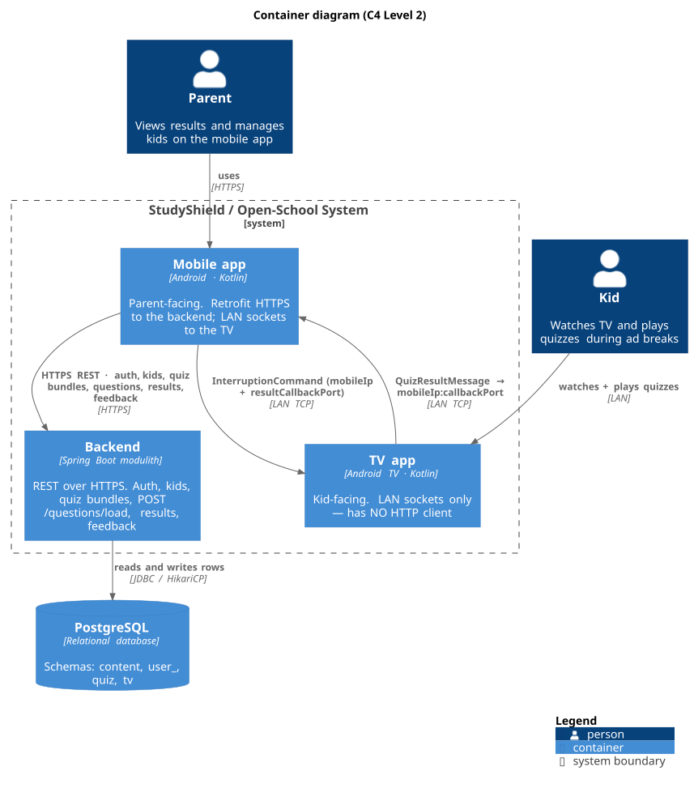

# Overall system

StudyShield is an ad-break "learning instead of watching" product: when a kid watches TV,
quizzes interrupt ad breaks and a parent views results on the mobile app.

## Container diagram (C4 Level 2)

The high-level deployable building blocks and how they communicate.

Source: `diagrams/container.puml` (rendered with PlantUML + C4-PlantUML via `./scripts/diagrams.sh`).

> ⚠️ **The TV app does NOT talk to the backend.** It has no HTTP client. All TV ↔ backend
> data (content, results) flows through the **mobile app** as the intermediary.

### Data-flow detail

| Edge | Transport | Direction | Payload |
|------|-----------|-----------|---------|
| Mobile ↔ Backend | **HTTPS REST** (Retrofit, `onrender.com`) | two-way | auth, kid profiles, quiz bundles, `POST /questions/load`, pushed results, feedback |
| Mobile → TV | **LAN TCP** to TV's own `ServerSocket(8888)` | one-way | `InterruptionCommand` (with `mobileIp` + `resultCallbackPort`) |
| TV → Mobile | **LAN TCP** to the mobile's `callbackPort` | one-way | `QuizResultMessage` (score, kidName) |
| Backend → DB | **JDBC / HikariCP** | two-way | SQL over rows in module schemas |

> For the internals of the backend container see the
> [Component diagram (C4 L3)](backend.md#component-diagram-c4-level-3); internals of the
> mobile and TV containers live in [mobile & TV](mobile-tv.md).

## Trust/communication model

- Mobile and TV connect over a **local network** (`ServerSocket` callback pattern): mobile
  sends `InterruptionCommand` (containing `mobileIp` + `resultCallbackPort`) to the TV's
  listener socket; the TV then opens its own socket back to the mobile's `callbackPort` and
  sends the `QuizResultMessage`.
- Both mobile and TV maintain **their own** copies of `InterruptionCommand` /
  `QuizResultMessage` — any new field must be added to BOTH.
- The mobile is the only app that reaches the backend; it is therefore the sync point for
  quiz content (trial seed via `POST /questions/load`) and results.
- Result attribution is keyed by `kidName` so results stay correct across account switches
  (the TV must not replay a stale callback port from a previous account).

## Repos

| Repo | Role |
|------|------|
| `study-shield` | mobile + TV Android apps |
| `study-shield-backend` | Spring Boot modulith |
| `study-shield-backend-admin` | admin tooling |
| `open-school` | Open-School / digital school |
