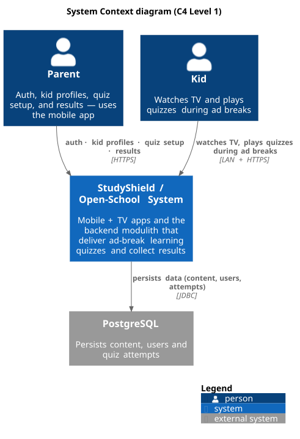

# StudyShield / Open-School Documentation

Single aggregated home for documentation across the StudyShield product family and the
Open-School / private digital school project. Each app keeps its **own** repo-local docs
(versioned and shipped with the code); this site indexes and cross-links them so an LLM
agent or human can pull the whole picture from one place.

## System context (C4 Level 1)

The whole system as a single box, seen from the outside: who uses it, and what it depends on.

> Rendered with **PlantUML + C4-PlantUML** (the de-facto standard toolset for C4
> diagrams), not hand-drawn or AI-art. Source: `diagrams/system-context.puml` — regenerate
> with `./scripts/diagrams.sh`.

## Repos covered

| Repo | Purpose | Own docs location |
|------|---------|-------------------|
| `study-shield` | Android mobile + Android TV apps | `study-shield/docs/`, `quiz-schema.md`, `SCREEN_FLOWS_*.md` |
| `study-shield-backend` | Spring Boot modulith (API) | `study-shield-backend/ss-modulith/docs/` |
| `study-shield-backend-admin` | Admin tooling | (repo) |
| `open-school` | Open-School / digital school | `open-school/docs/{RESEARCH,PLANS}/` |
| `my-private-digital-school` | Private digital-school data/repo | (repo) |

## Start here

- **Architecture** — [overall system](architecture/system.md), [backend modulith](architecture/backend.md), [mobile & TV](architecture/mobile-tv.md)
- **Per-repo** — [backend](per-repo/backend.md), [mobile & TV](per-repo/mobile-tv.md), [open-school](per-repo/open-school.md)
- **Decisions** — [question bank process & rules](decisions/question-bank-guide.md), [ADR log](decisions/adr-log.md), [diagramming standard](decisions/diagramming-standard.md)

## How the site works

- Built with **MkDocs** (Material theme) from the `docs/` folder here.
- `./scripts/serve.sh` runs it locally; `./scripts/build.sh` produces static `site/` output
  deployable to any static host (GitHub Pages, Netlify, Render).
- See the repo `README.md` (at the repo root, outside this rendered site) for setup details.
